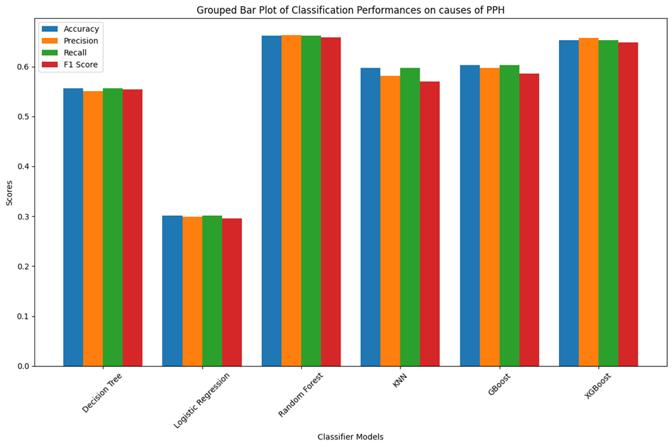

## Model comparison 
Classification performance metrics for various machine learning models applied to the prediction of postpartum hemorrhage (PPH) causes. Decision Tree, Random Forest, GBoost, and XGBoost exhibit relatively balanced performance across all four metrics, with all scores around 0.6 to 0.7. 
KNN has similar performance across metrics, scoring slightly lower than the other tree-based models but still demonstrating robust classification capability. Logistic Regression shows the lowest performance across all metrics, with scores around 0.3, suggesting this model may be underfitting or not well-suited for the task compared to the others. Among the models, Random Forest, GBoost, and XGBoost show consistently high performance across the board, with little variation between accuracy, precision, recall, and F1 scores, indicating they may be better at handling the classification of PPH causes.

